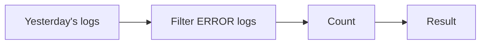

I'm starting a series of public notes about my studies in data processing and Apache Flink. Before getting to Flink, I decided to take a few steps back and understand the problem that this kind of tool is meant to solve. So in these first posts, I'll build a theoretical foundation and clarify concepts before we get to Flink and how it works.

## The problem

A good place to start is with the data.

::: warning
In the context of observability, logs, metrics, and traces are **signals**: clues that systems leave about what is happening. In this study, we'll look mainly at logs. Each log record is a signal, and when it enters a flow to be processed, I'll call it an **event**.
:::

Imagine thousands of services, mobile applications, and backends emitting logs. One service records the start of a payment, another a slowdown, another a failure.

Those records do not all appear at once; they keep arriving as things happen.

The difference may seem small, but it changes the entire architecture.

### When data has an end

Think about the question: “How many errors happened yesterday?”

We can access yesterday's stored logs, read that set, filter records at the `ERROR` level, count them, and return a result. The set is finite: it has a first and a last record. This is the classic **batch processing** scenario (a *bounded stream*).



In this case, processing ends because the data ends too.

### When data keeps arriving...

Now replace the question with: “How many errors are happening right now?” Or: “Notify me if a service exceeds one thousand errors in five minutes.”

There is no longer a last log to wait for. Another one can always arrive.

```
record 1, record 2, record 3, ...
```

This is a data flow without a defined end (an *unbounded stream*). Instead of running a query against closed history, we need to keep a computation running continuously.

An operation that seemed simple—"just" a `COUNT(logs)`—now raises an uncomfortable question: "When would that result be ready?" The answer is: "In an infinite stream, **NEVER**."

That is why streaming questions usually need context. We do not want to know only “how many errors exist,” but “how many errors occurred in the last five minutes?”

This is where concepts such as time windows, state, fault tolerance, and distributed processing come from. They are not implementation details yet; they are direct consequences of the fact that data never stops arriving.

## The idea I want to keep

Batch and streaming do not differ only in how often data is processed. They start from fundamentally different kinds of problems.
```
finite data       -> process and finish
continuous data   -> process and continue
```

Apache Flink fits precisely into the second scenario, it was created to run continuous computations over data streams, including when we need to keep context between events, deal with time, and recover work after failures. But, as I mentioned at the beginning, the idea is not to dive into Flink just yet. First, I want to understand and internalize some concepts that will make things easier once we get to the tool.

In the next post, I'll explore the first practical consequence of this: if I want to count errors by service, where does that counter live?

See you in the next post!

_References: [observability signals in OpenTelemetry](https://opentelemetry.io/docs/concepts/signals/) and [Apache Flink architecture overview](https://flink.apache.org/what-is-flink/flink-architecture/)._
