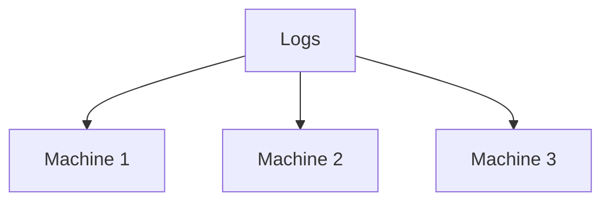
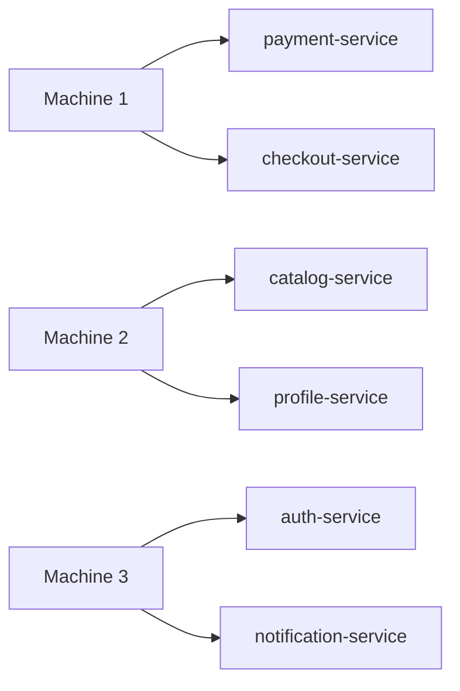
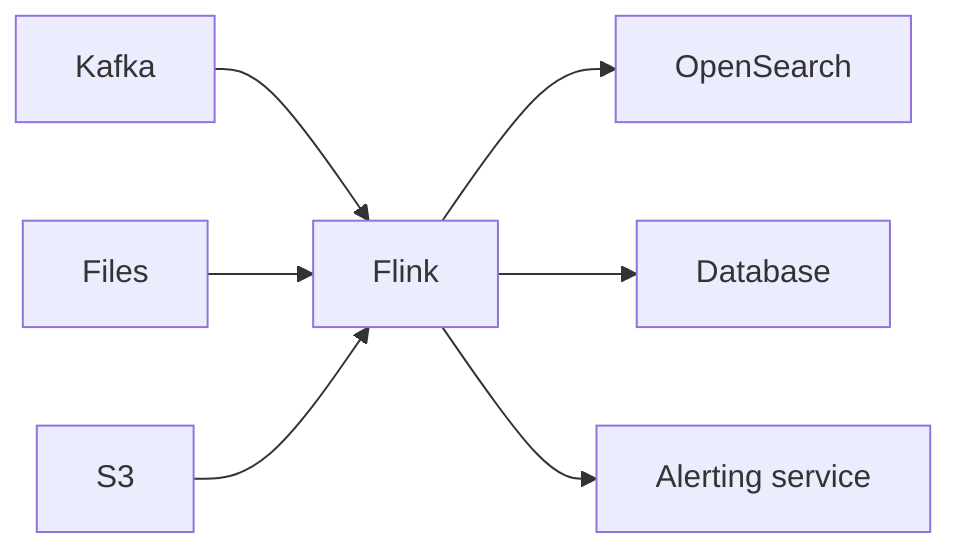

In the previous post, I built a simple alert: notify me when a service has more than three errors within five minutes. At a low volume, a single machine could read the logs and maintain the counters.

## The problem

But imagine a platform with hundreds of services and millions of logs per minute. One machine cannot keep up. We need several.



This design solves the capacity problem, but creates another one: logs from the same service still need to “find the right memory.”

### We cannot split the logs arbitrarily

Suppose these four payment errors are split between two machines:

```text
machine 1 receives: 10:00:11 and 10:03:42
machine 2 receives: 10:01:28 and 10:04:17
```

Each machine sees only two errors. Neither would trigger the alert, even though `payment-service` produced four errors during the period.

Without getting into how this distribution works under the hood, let’s imagine that each service is assigned to one machine. This way, all logs from `payment-service` are analyzed together (while other services can be assigned to the other machines).



This distribution lets us increase capacity without breaking a computation that depends on state. In future posts, we can look at how tools such as Flink perform this distribution.

### What if the machine responsible for payments goes down?

Let’s say machine 1 held this state shortly before the failure:

```text
payment-service -> 3 errors in the current window
```

If it goes down and the application restarts from scratch, the next error would be treated as the first one. The alert might never be emitted. Worse, if the stream is replayed carelessly, logs that have already been counted could be counted twice.

**Checkpoints** exist so that the application does not depend on a single machine’s memory. From time to time, the application saves a consistent snapshot of its state and the positions of the sources supplying the stream.

```text
saved checkpoint:
payment-service -> 3 errors
source position -> offset 8,421,900
```

After the failure, another machine can restore that point and reread the events that came afterward. It then knows that the next `payment-service` error is the fourth—not the first.

This example is simplified, but it already shows what we expect from a streaming application: it should continue producing correct results even when processes, machines, or connections fail.

### There is one last thing: the event timestamp

Consider two logs:

```text
arrives at 10:05:01 -> error occurred at 10:05:01
arrives at 10:05:03 -> error occurred at 10:04:58
```

By arrival order, the first came earlier. By event time, the second happened first. Delays like this are normal in real networks: queues, retries, and buffers make events travel at different speeds.

So, to decide whether an event belongs in the five-minute window, we need to distinguish between:

```text
processing time -> when the system received the event
event time      -> when the event actually occurred
```

Later, *event time* and *watermarks* will help us handle this difference. For now, the question is: how long should we wait for a late event before finalizing a result?

### Where does Flink fit into this picture?

It is easy to look at this example and think that Flink is a tool for processing Kafka data. Kafka may be a very common input, but it does not define Flink.

Flink sits in the middle of the architecture and performs the processing. It can receive data from Kafka, files, or object storage and send the results to different destinations:



Our example focuses on logs that never stop arriving, but Flink can also process data with a defined beginning and end, such as a set of files from yesterday. What changes is the kind of computation we need to perform, not the idea of using Flink as the processing runtime.

## The idea I want to keep

This small alert has already raised several problems: a continuous stream, a history for each service, work distributed across machines, and recovery after failures. Even then, we still need to decide when each event actually occurred.

I do not need to understand every detail of how a tool solves these problems just yet. For now, I want to keep one idea in mind: when processing is distributed across machines, processing faster is not enough. We also need to keep computing the right results when a machine goes down or an event arrives late.

```text
stream → state → time → fault tolerance
```

This is the mental model I want to carry into the next stages of my studies. Flink is the runtime that brings together mechanisms for dealing with these four ideas without being tied to a single data source such as Kafka.

In the next step of my studies, I want to better understand what it means to run this kind of computation on more than one machine.

_References: [Apache Flink architecture](https://flink.apache.org/what-is-flink/flink-architecture/), [operations and recovery](https://flink.apache.org/what-is-flink/flink-operations/), and [time handling in Flink 2.2](https://nightlies.apache.org/flink/flink-docs-release-2.2/docs/concepts/time/)._
