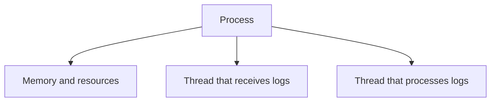

In the previous post, we reached an important point: as volume grows, one machine may not be able to handle the processing. But before we talk about adding machines, it is worth asking a more basic question: what work is growing?

## The problem

Imagine that we are monitoring logs from several services and want to maintain an error count for each service. Every new record needs to go through a few steps:

Everything the system needs to do is its **workload**.

**Workload is not just the number of logs**. It also includes how frequently they arrive, the transformations they require, the memory used to store the counters, and how quickly we expect a result.

Ten logs per second and one million logs per second may use the same logic. What changes is the amount of work required to keep up with the stream.

### Where does this work run?

A **process** is an instance of a running program. We can think of a process as the place where part of an application runs, with its own memory, connections, and resources.

Inside it are **threads**: lines of execution that allow the process to do more than one thing over time.

Threads in the same process can access the same memory. This makes communication easier, but it also requires care. If two threads try to update the same counter at the same time, one update may overwrite the other. This kind of problem is a **race condition**.

Different processes, on the other hand, do not share memory directly. This provides isolation and creates a **failure boundary**: if one process stops, the other does not go down with it. But it also creates a new need: they must communicate to exchange data.

## The idea I want to keep

Scaling is not just about adding more CPU or more machines. First, we need to understand the workload: what arrives, what needs to be done with each record, and which resources each step consumes.

Processes and threads are the first pieces of this puzzle. In the next post, I will separate three ideas that are often mixed together: concurrency, parallelism, and distribution.
