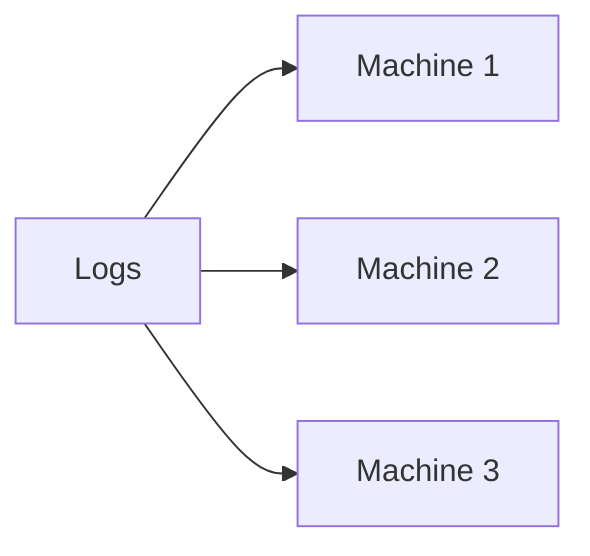

When we talk about “processing faster,” it is easy to put concurrency, parallelism, and distribution in the same bucket. They are related, but they do not mean the same thing.

## The problem

Think of two tasks: validating a log and sending an alert.

On a machine with only one core, the system can switch between them:

Both tasks are making progress during the same period, but they are not running at the same instant. This is **concurrency**.

Now imagine that two cores are available:

Here we have **parallelism**: different parts of the work run at the same time.

### Where does distribution fit in?

So far, both cores could be on the same machine. Distribution is when we spread execution across independent components, usually on different machines connected over a network.

These machines are called **nodes**. When multiple nodes work together to run a workload, they form a **cluster**.

When we increase capacity by adding new nodes to the cluster, we are scaling horizontally. Increasing the CPU or memory of the same machine is vertical scaling.

### A quick comparison

| Concept | A question that helps explain it |
| --- | --- |
| Concurrency | How many units of work can be in progress? |
| Parallelism | How many parts can run at the same time? |
| Distribution | Across how many independent machines is the work spread? |

We can have concurrency without parallelism, as in the example of a single core switching between tasks. We can also have parallelism without distribution, with multiple cores on the same machine.

And having a parallelism of four does not automatically mean four machines or four dedicated cores. It only means that the logic has been divided into four parts that can work in parallel. Where they run is a separate decision.

This number of parts is the **degree of parallelism**. It describes the logical division of work, not the physical infrastructure. Four instances may occupy four cores, contend for two cores, or even run on different machines.

There is also a simple limit: not every task can be divided freely. If the counting step can only begin after an entire validation has finished, one depends on the other. Parallelism appears where there are sufficiently independent parts.

## The idea I want to keep

Concurrency organizes multiple units of work in progress. Parallelism makes parts of the work happen at the same time. Distribution takes that work beyond a single machine.

Distribution solves the capacity limit, but it creates a new question: how do we split the logs without breaking the error count for each service? That is the topic of the next post.
