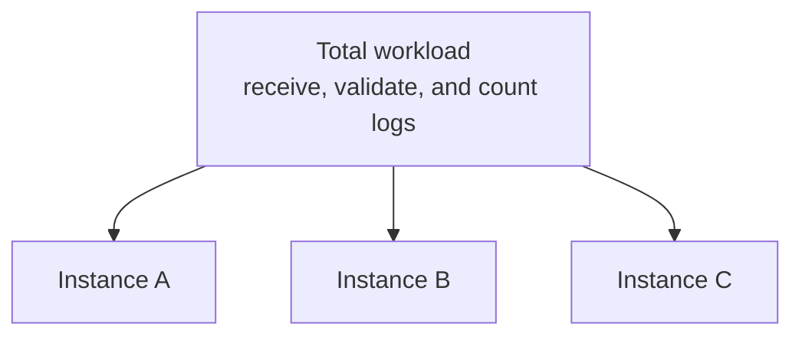

In the previous post, we saw that parallelism and distribution can increase processing capacity. But how does a large workload turn into work for multiple instances?

## The problem

Let's go back to the example of counting errors per service. One machine can no longer keep up with all the logs, so we need to split the work:



Each instance starts running a portion of the workload. This can increase capacity because multiple parts progress at the same time.

But splitting the work creates two questions that didn't exist when everything ran on a single machine:

1. Where should each record go?
2. When multiple records contribute to the same result, how do they reach the right place?

### Not all work needs the same rule

If a stage only validates the structure of each log, a record can be treated in isolation. Any available instance can perform this validation.

On the other hand, counting by service requires more care. Records from the `payment-service` contribute to the same count, so the system needs to guarantee that the computation has access to the necessary history.

```text
payment-service ERROR
payment-service ERROR
payment-service ERROR
```

We won't get into the rule that decides the destination of these records just yet. For now, it's enough to realize that splitting the workload isn't just about starting more processes. It's about separating the work in a way that preserves the result we want to calculate.

### The parts need to talk to each other

After the split, instances may need to exchange data, intermediate results, or progress information. If they are in different processes or nodes, they do not share memory directly.

This is where the next question comes in: how does a record leave the memory of one process and reach another?

## The idea I want to keep

Splitting the workload can increase capacity, but it creates the responsibility of giving records a destination and keeping the computation correct. The more parts there are, the more important communication and coordination between them become.

In the next post, we will see what happens when this data needs to cross processes or machines.
