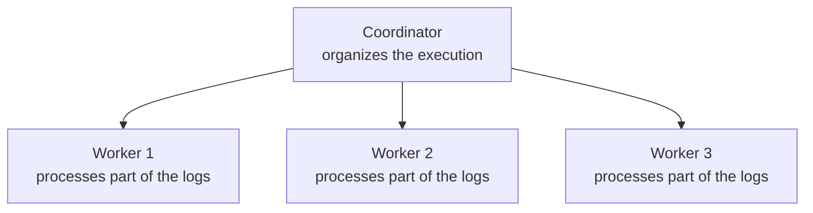

After understanding workload, concurrency, parallelism, distribution, and communication between processes, one piece is still missing: who organizes the execution as a whole?

## The problem

Imagine that we have three machines executing parts of an error count:



The **workers** are the ones that perform the actual work: they receive part of the data, apply the transformations, and maintain whatever is needed while processing.

The **coordinator** does not need to count every log itself. Its role is to organize the execution: decide or keep track of who is responsible for each part, observe progress, and react when something does not go as expected.

### When one part fails

Now Worker 2 stops working. The other two remain up, but one part of the workload is no longer being processed.

```text
Worker 1 → running
Worker 2 → failed
Worker 3 → running
```

This is a **partial failure**. The system is not completely down, but it is not completely healthy either.

At this point, the coordinator needs to deal with questions such as:

- Who will take over the work that Worker 2 was doing?
- What was the last known state of that part?
- Which logs arrived after that point?
- How can processing continue without losing a count or counting it twice?

The coordinator does not solve these problems alone. It relies on mechanisms such as **saved state**, **checkpoints**, and the **ability to reread the data**. But it is the coordinator that organizes the recovery.

### Coordination is work too

Beyond handling failures, the coordinator tracks resources, assigns new parts of the work when necessary, and helps maintain a view of the whole system. Workers stay closer to the day-to-day processing, while the coordinator keeps the overall execution organized.

This separation prevents each worker from having to figure out on its own what the rest of the system is doing.

## The idea I want to keep

A distributed architecture usually separates who **coordinates** from who **executes**:

- Workers process parts of the workload
- The coordinator observes the whole, tracks failures, and organizes recovery.

In the next post, I will connect these generic roles to the names used by Apache Flink. Only then will we start these processes in a local cluster.
