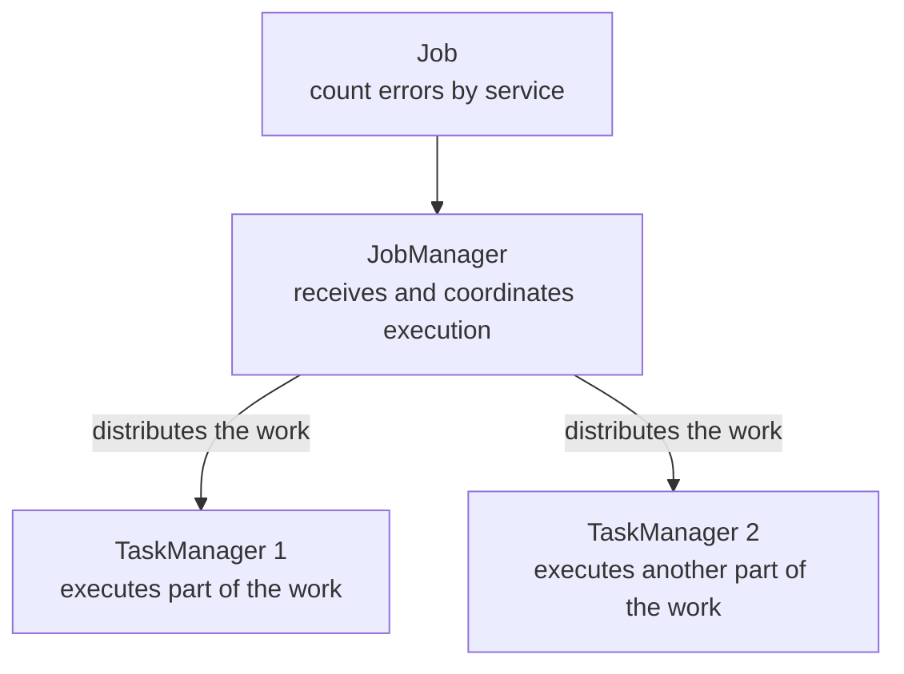

In the previous post, we saw that distributed systems usually separate who coordinates from who executes the work. Flink follows the same idea, but gives its own names to these pieces.

## The problem

Imagine we want to run our error count by service as a continuous computation. In Flink, this complete computation is a **Job**.

The Job needs someone to monitor the execution and processes to make the work happen. This is where **JobManager** and **TaskManagers** come in.



### The role of the JobManager

The **JobManager** is the concrete version of the coordinator we saw earlier. It receives the Job, organizes the execution, tracks progress, and coordinates recovery when something fails.

It does not process each log individually. Its job is to keep a view of the whole: which parts are running, where the resources are, and what needs to happen if one of them stops.

### The role of the TaskManagers

The **TaskManagers** are the workers in Flink. They execute parts of the Job, send and receive data when needed, and maintain the state used during processing.

Later on, we will give more specific names to these parts. For now, it is enough to keep in mind that the real work happens in the TaskManagers.

A TaskManager is a **process**, not necessarily an entire machine. In a local environment, it may run in a container; in production, several TaskManagers can be distributed across multiple nodes.

## The idea I want to keep

The generic model now has concrete names:

```text
coordinator → JobManager
workers     → TaskManagers
computation → Job
```

In the next post, I will bring these processes up locally with Docker Compose and show how they form a real Flink cluster.

_Reference: [Apache Flink architecture](https://nightlies.apache.org/flink/flink-docs-release-2.2/docs/concepts/flink-architecture/)._
