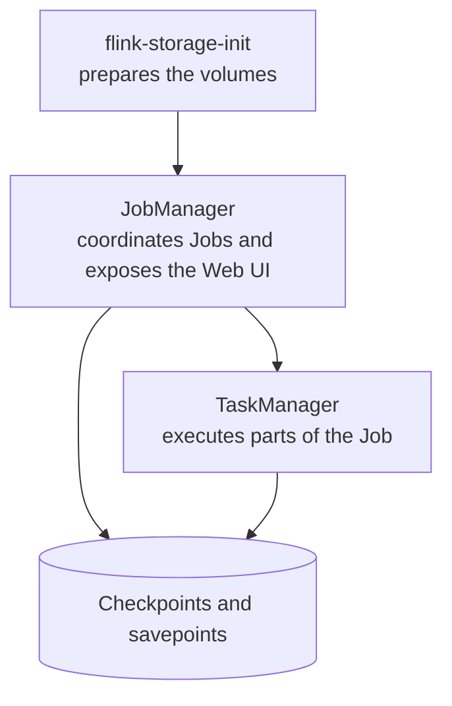

In the previous post, we saw how Flink names the coordinator and worker roles. Now I want to turn JobManager and TaskManagers into something I can run locally.

I do not need several physical machines to study. Docker Compose creates isolated processes on my computer and makes the relationship between coordinator, worker, and storage easier to see.

## The cluster we will bring up

This is the `compose.yaml` excerpt used in the lab. It creates a JobManager, a TaskManager, and volumes for checkpoints and savepoints. There is also a workspace volume, which is a choice made for this lab, not a Flink requirement.

```yaml
name: flink-studies

services:
  flink-storage-init:
    image: flink:2.2.1-scala_2.12-java21
    user: "0:0"
    entrypoint: ["/bin/sh", "-c"]
    command:
      - chown -R 9999:9999 /opt/flink/checkpoints /opt/flink/savepoints
    volumes:
      - flink-checkpoints:/opt/flink/checkpoints
      - flink-savepoints:/opt/flink/savepoints

  jobmanager:
    image: flink:2.2.1-scala_2.12-java21
    command: jobmanager
    depends_on:
      flink-storage-init:
        condition: service_completed_successfully
    ports:
      - "8081:8081"
    environment:
      FLINK_PROPERTIES: |
        jobmanager.rpc.address: jobmanager
        jobmanager.memory.process.size: 1024m
        parallelism.default: 2
        state.checkpoints.dir: file:///opt/flink/checkpoints
        state.savepoints.dir: file:///opt/flink/savepoints
    volumes:
      - flink-checkpoints:/opt/flink/checkpoints
      - flink-savepoints:/opt/flink/savepoints
      - ../../../..:/workspace:ro

  taskmanager:
    image: flink:2.2.1-scala_2.12-java21
    command: taskmanager
    depends_on:
      jobmanager:
        condition: service_started
    environment:
      FLINK_PROPERTIES: |
        jobmanager.rpc.address: jobmanager
        taskmanager.memory.process.size: 1024m
        taskmanager.numberOfTaskSlots: 2
        parallelism.default: 2
        state.checkpoints.dir: file:///opt/flink/checkpoints
        state.savepoints.dir: file:///opt/flink/savepoints
    volumes:
      - flink-checkpoints:/opt/flink/checkpoints
      - flink-savepoints:/opt/flink/savepoints
      - ../../../..:/workspace:ro

volumes:
  flink-checkpoints:
  flink-savepoints:
```

### Before starting Flink

`name` gives the Docker environment a name. Inside `services`, each block creates a container with a specific responsibility.

`flink-storage-init` does not run a Job. It prepares the volumes that will store checkpoints and savepoints. The Flink image uses its own user; for that reason, the container starts as `user: "0:0"`, runs `chown`, and ensures that this user has write permission in the mounted directories.

`volumes` creates persistent storage managed by Docker. This way, checkpoint files do not live only inside a container that may be removed.

### Who coordinates the Job

The `jobmanager` service uses the same image, but `command: jobmanager` defines its role. It will be the process that receives Jobs, coordinates execution, and exposes the Web UI.

| Configuration | What it does |
| --- | --- |
| `depends_on` | Waits for volume preparation to finish. |
| `8081:8081` | Exposes the Web UI at `http://localhost:8081`. |
| `jobmanager.rpc.address` | Gives the other processes the name they use to locate the JobManager on the internal Compose network. |
| `jobmanager.memory.process.size` | Reserves 1 GB for the JobManager process. |
| `parallelism.default` | Sets 2 as the default parallelism when the Job does not choose another value. |
| `state.checkpoints.dir` and `state.savepoints.dir` | Point to the persistent directories mounted in the container. |

### The workspace volume

The `../../../..:/workspace:ro` volume mounts the root of my study directory inside the container. In my case, it makes the JAR generated by Maven visible to the JobManager, so I can submit it using a path such as `/workspace/01-fundamentos/...`.

The relative path is easier to understand by looking at the directory structure I use locally:

```text
my-flink-studies/
└── 01-fundamentos/
    └── labs/
        ├── day00/
        │   └── resources/
        │       └── compose.yaml  <- current file
        └── day03/
```

Because `compose.yaml` is in `labs/day00/resources`, `../../../..` goes up four levels to `my-flink-studies`. That is the directory that becomes available as `/workspace` in the containers. Even when running the command from the root of that directory, Docker Compose resolves the relative path from the directory containing the Compose file.

This volume is not required for Flink to form or run a cluster. After the JobManager receives the JAR, Flink itself distributes it to the TaskManagers. The mount on the TaskManager exists because, in future exercises, some Jobs will read example files that also live in this directory.

The `:ro` suffix means *read-only*: the containers can read the files, but cannot change them. In another project, this path could be different, the files could be included in the image, or the data source could be outside the local machine. What matters is that each process that needs to read a file can access it at the path configured by the Job.

### Who executes the work

The `taskmanager` service uses `command: taskmanager`. It is the cluster's worker: it executes parts of the Job assigned by the JobManager.

It waits for the JobManager to start and uses the same `jobmanager.rpc.address` to connect to it. `taskmanager.numberOfTaskSlots: 2` provides two slots, meaning enough capacity to run up to two parts of the Job at the same time in this process. The checkpoint and savepoint directories are the same so that state can be recovered when necessary.



## Starting and verifying the environment

From the root of the study directory, the environment starts with:

```bash
docker compose -f 01-fundamentos/labs/day00/resources/compose.yaml up -d
```

Afterward, I can confirm the containers:

```bash
docker compose -f 01-fundamentos/labs/day00/resources/compose.yaml ps
```

With the JobManager and TaskManager running, the Web UI is available at `http://localhost:8081`. There is not a Job to observe yet; that is the next step.

## The idea I want to keep

Compose is not just a convenient way to "run Flink". It turns the concepts into real processes: the JobManager coordinates, the TaskManager executes, and the volumes preserve state.

In the next post, I will create the Java project, generate the JAR, and submit it to this cluster.
