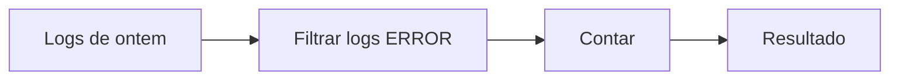

Estou começando uma sequência de anotações públicas sobre meus estudos de processamento de dados e Apache Flink. Antes de chegar no Flink, decidi voltar alguns passos e entender qual é o problema que esse tipo de ferramenta tenta resolver. Então nesses primeiros posts estarei criando uma base teórica e esclarecendo conceitos até chegar no Flink e seu funcionamento.

## O problema

Uma boa forma de começar é olhando para os dados.

::: warning
No contexto de observabilidade, logs, métricas e traces são **sinais**: pistas que os sistemas deixam sobre o que está acontecendo. Neste estudo, vamos olhar principalmente para logs. Cada registro de log é um sinal e, quando entra em um fluxo para ser processado, vou chamá-lo de **evento**.
:::

Imagine milhares de serviços, aplicações móveis e backends emitindo logs. Um serviço registra o início de um pagamento, outro uma lentidão, outro uma falha.

Esses registros não aparecem todos de uma vez, eles continuam aparecendo conforme vão acontecendo.

Essa diferença parece pequena, mas muda a arquitetura inteira.

### Quando os dados têm fim

Pensa na pergunta: “quantos erros aconteceram ontem?”

Podemos acessar os logs de ontem que foram armazenados, ler esse conjunto, filtrar os registros com nível `ERROR`, contar e devolver um resultado. O conjunto é finito: há um primeiro e um último registro. Esse é o cenário clássico de **batch processing** (*bounded stream*).



Nesse caso, o processamento termina porque os dados também terminam.

### Quando os dados continuam chegando...

Agora troque a pergunta por: “quantos erros estão acontecendo agora?” Ou: “avise se um serviço ultrapassar mil erros em cinco minutos”.

Não existe mais um último log a esperar. Sempre pode chegar mais um.

```
registro 1, registro 2, registro 3, ...
```

Esse é um fluxo de dados sem fim definido (*unbounded stream*). Em vez de executar uma consulta sobre um histórico fechado, precisamos manter uma computação em funcionamento contínuo.

Uma operação que parecia simples, "só" um `COUNT(logs)`, ganha uma pergunta incômoda: "quando esse resultado estaria pronto?" E a resposta é: "Em um fluxo infinito, **NUNCA**".

Por isso, em streaming, as perguntas normalmente precisam de contexto. Não queremos saber apenas “quantos erros existem”, mas “quantos erros ocorreram nos últimos cinco minutos?”.

É daqui que surgem conceitos como janelas de tempo, estado, tolerância a falhas e processamento distribuído. Ainda não são detalhes de implementação, são consequências diretas do fato de que os dados não param de chegar.

## A ideia que quero guardar

Batch e streaming não são apenas duas velocidades de processamento. Eles partem de tipos diferentes de problema:

```
dados finitos    -> processar e concluir
dados contínuos  -> processar e continuar
```

O Apache Flink entra justamente nesse segundo cenário. Ele foi criado para executar computações contínuas sobre fluxos de dados, inclusive quando precisamos manter contexto entre eventos, lidar com tempo e recuperar o trabalho após falhas.
Mas, como falei no início, a ideia não é entrar no Flink agora. Antes quero entender e internalizar alguns conceitos que vão facilitar quando chegarmos na ferramenta.

No próximo post, vou explorar a primeira consequência prática disso: se quero contar erros por serviço, onde esse contador fica?

Até a próxima!

_Referências: [sinais de observabilidade no OpenTelemetry](https://opentelemetry.io/docs/concepts/signals/) e [visão geral da arquitetura do Apache Flink](https://flink.apache.org/what-is-flink/flink-architecture/)._ 
