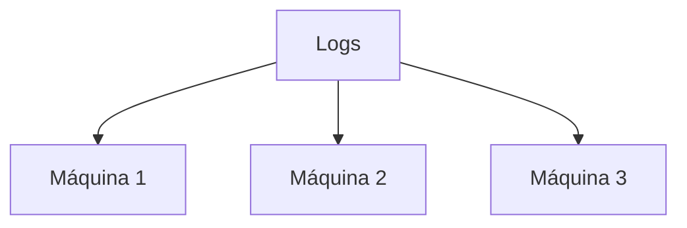
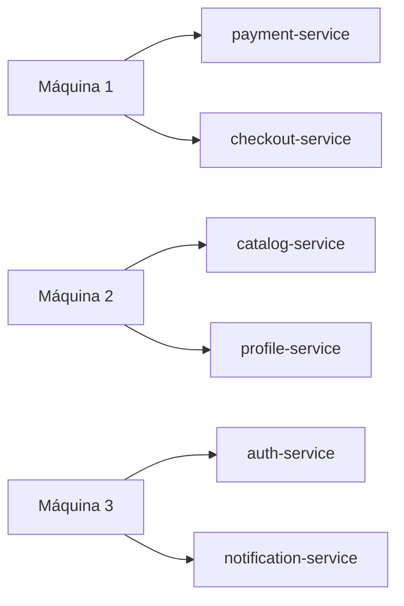
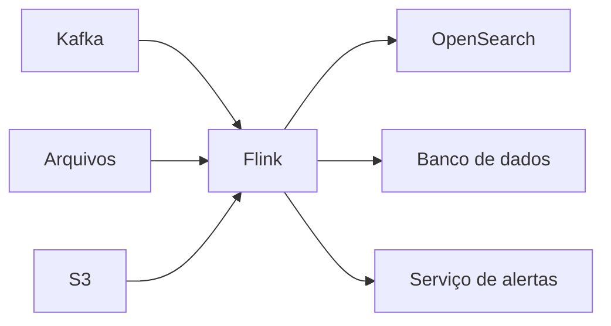

No post anterior, montei um alerta simples: avisar quando um serviço tiver mais de três erros em cinco minutos. Com pouco volume, uma máquina poderia ler os logs e manter os contadores.

## O problema

Mas imagina uma plataforma com centenas de serviços e milhões de logs por minuto. Uma máquina só não acompanha o ritmo. Precisamos de várias.



Esse desenho resolve o problema de capacidade, mas cria outro: os logs de um mesmo serviço precisam continuar "encontrando a memória certa".

### Não podemos dividir os logs de qualquer maneira

Suponha que estes quatro erros de pagamento sejam divididos entre duas máquinas:

```text
máquina 1 recebe: 10:00:11 e 10:03:42
máquina 2 recebe: 10:01:28 e 10:04:17
```

Cada máquina enxerga apenas dois erros. Nenhuma dispararia o alerta, mesmo que `payment-service` tenha cometido quatro erros no período.

Sem entrar em como essa divisão acontece por baixo dos panos, vamos imaginar que cada serviço fica sob responsabilidade de uma máquina. Assim, todos os logs do `payment-service` são analisados juntos (outros serviços podem ficar nas outras máquinas).



É essa divisão que deixa a gente aumentar a capacidade sem quebrar um cálculo que depende de estado. Em outros posts, podemos ver como ferramentas como o Flink fazem essa distribuição.

### E se a máquina responsável pelo pagamento cair?

Vamos dizer que a máquina 1 guardava este estado pouco antes da falha:

```text
payment-service -> 3 erros na janela atual
```

Se ela cair e a aplicação recomeçar do zero, o próximo erro seria tratado como o primeiro. O alerta poderia nem ser emitido. Pior: se o fluxo for reenviado sem cuidado, logs já contabilizados poderiam entrar na conta duas vezes.

É para não depender da memória de uma máquina que existem os **checkpoints**. De tempos em tempos, a aplicação salva uma fotografia consistente do estado e das posições das sources que fornecem o fluxo.

```text
checkpoint salvo:
payment-service -> 3 erros
posição da source -> offset 8.421.900
```

Depois da falha, outra máquina pode restaurar esse ponto e reler os eventos posteriores. Assim, ela volta a saber que o próximo erro do `payment-service` é o quarto (e não o primeiro).

O exemplo é simplificado, mas já mostra o que a gente espera de uma aplicação de streaming: continuar produzindo resultados corretos mesmo quando processos, máquinas ou conexões falham.

### Há uma última coisa: o horário do evento

Considere dois logs:

```text
chega às 10:05:01 -> erro que aconteceu às 10:05:01
chega às 10:05:03 -> erro que aconteceu às 10:04:58
```

Pela ordem de chegada, o primeiro veio antes. Pelo horário em que ocorreram, foi o segundo. Em redes reais, atrasos assim são normais: filas, retentativas e buffers fazem os eventos viajarem em velocidades diferentes.

Então, para decidir se um evento entra ou não na janela de cinco minutos, precisamos distinguir:

```text
processing time -> quando o sistema recebeu o evento
event time      -> quando o fato aconteceu
```

Mais adiante, *event time* e *watermarks* vão ajudar a tratar essa diferença. Por enquanto, a pergunta que fica é: até quanto tempo esperamos por um evento atrasado antes de fechar um resultado?

### Onde o Flink entra nessa história?

É fácil olhar para esse exemplo e pensar que Flink é uma ferramenta para processar Kafka. Kafka pode ser uma entrada muito comum, mas não define o Flink.

O Flink fica no meio da arquitetura, executando o processamento. Ele pode receber dados de Kafka, arquivos ou armazenamento de objetos e enviar os resultados para diferentes destinos:



Nosso exemplo está focado em logs que não param de chegar, mas o Flink também pode processar dados que têm começo e fim definidos, como um conjunto de arquivos de ontem. O que muda é o tipo de cálculo que precisamos fazer, não a ideia de usar o Flink como runtime de processamento.

## A ideia que quero guardar

Esse pequeno alerta já trouxe vários problemas: um fluxo contínuo, um histórico para cada serviço, trabalho dividido entre máquinas e recuperação após falhas. E, mesmo assim, ainda precisamos decidir em qual horário cada evento realmente aconteceu.

Não preciso entender agora todos os detalhes de como uma ferramenta resolve isso. Por enquanto, quero guardar uma ideia: quando o processamento é dividido entre máquinas, não basta processar mais rápido. A gente também precisa continuar calculando certo quando uma máquina cai ou quando um evento chega atrasado.

```text
stream → state → time → fault tolerance
```

Esse é o mapa mental que quero levar para os próximos estudos. O Flink é o runtime que reúne mecanismos para lidar com essas quatro ideias, sem estar preso a uma única fonte de dados como Kafka.

No próximo passo dos meus estudos, quero entender melhor o que significa colocar esse tipo de cálculo para rodar em mais de uma máquina.

_Referências: [arquitetura do Apache Flink](https://flink.apache.org/what-is-flink/flink-architecture/), [operações e recuperação](https://flink.apache.org/what-is-flink/flink-operations/) e [processamento temporal no Flink 2.2](https://nightlies.apache.org/flink/flink-docs-release-2.2/docs/concepts/time/)._
