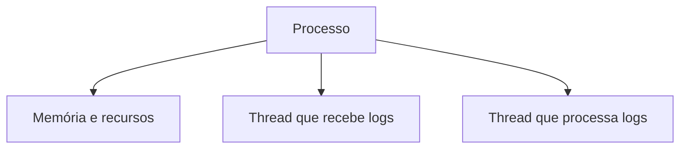

No post anterior, chegamos a um ponto importante: quando o volume cresce, uma máquina pode não dar conta do processamento. Mas, antes de falar em adicionar máquinas, vale uma pergunta mais básica: qual trabalho está crescendo?

## O problema

Imagina que estamos acompanhando logs de vários serviços e queremos manter uma contagem de erros por serviço. Cada novo registro precisa passar por algumas etapas:

Esse conjunto de coisas que o sistema precisa fazer é o **workload**.

**Workload não é só a quantidade de logs**. Também entram na conta a frequência com que eles chegam, as transformações necessárias, a memória usada para guardar os contadores e o tempo que esperamos para ter uma resposta.

Dez logs por segundo e um milhão de logs por segundo podem usar a mesma lógica. O que muda é o trabalho necessário para acompanhar esse fluxo.

### Onde esse trabalho roda?

Um **processo** é uma instância de um programa em execução. Podemos imaginar um processo como o lugar onde uma parte da aplicação está rodando, com sua própria memória, conexões e recursos.

Dentro dele, existem as **threads**, que são linhas de execução que permitem ao processo fazer mais de uma coisa ao longo do tempo.

As threads do mesmo processo conseguem acessar a mesma memória. Isso facilita a comunicação, mas também exige cuidado. Se duas threads tentam atualizar o mesmo contador ao mesmo tempo, uma atualização pode sobrescrever a outra. Esse tipo de problema é uma **condição de corrida** (*race condition*).

Já processos diferentes não compartilham essa memória diretamente. Isso traz isolamento e cria uma **fronteira de falha**: se um processo parar, o outro não desaparece junto. Mas também cria uma nova necessidade: para trocar dados, eles precisam se comunicar.

## A ideia que quero guardar

Escalar não é apenas colocar mais CPU ou mais máquinas. Antes, precisamos entender o workload: o que chega, o que precisa ser feito com cada registro e quais recursos cada etapa consome.

Processos e threads são as primeiras peças desse quebra-cabeça. No próximo post, vou separar três ideias que costumam aparecer misturadas: concorrência, paralelismo e distribuição.
