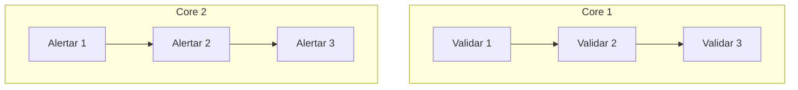
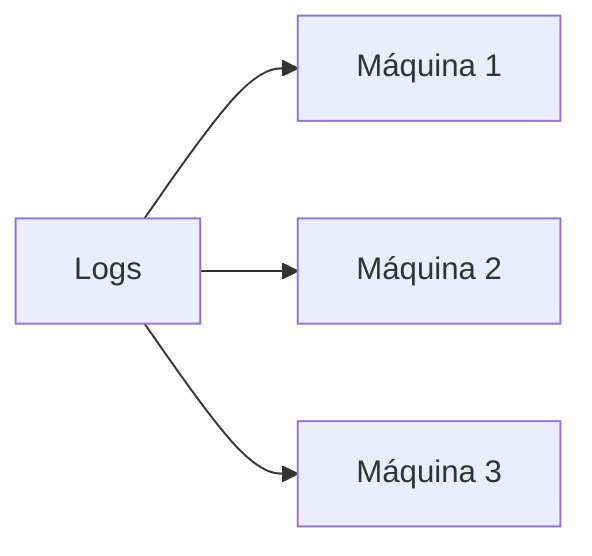

Quando falamos em “processar mais rápido”, é fácil colocar concorrência, paralelismo e distribuição no mesmo pacote. Eles se relacionam, mas não significam a mesma coisa.

## O problema

Pensa em duas tarefas: validar um log e enviar um alerta.

Em uma máquina com apenas um core, o sistema pode alternar entre elas:

As duas tarefas estão avançando no mesmo período, mas não executam no mesmo instante. Isso é **concorrência**.

Agora imagine dois cores disponíveis:

Aqui temos **paralelismo**: partes diferentes do trabalho executam ao mesmo tempo.

### E onde entra a distribuição?

Até agora, os dois cores podem estar na mesma máquina. Distribuição é quando espalhamos a execução entre componentes independentes, normalmente em máquinas diferentes e conectadas por rede.

Essas máquinas são chamadas de **nodes**. Quando vários nodes trabalham juntos para executar um workload, formam um **cluster**.

Quando aumentamos a capacidade adicionando novos nodes ao cluster, estamos fazendo **escalabilidade horizontal**. Já aumentar CPU ou memória da mesma máquina é **escalabilidade vertical**.

### Uma comparação rápida

| Conceito | Pergunta que ajuda a entender |
| --- | --- |
| Concorrência | Quantos trabalhos podem ficar em andamento? |
| Paralelismo | Quantas partes conseguem executar ao mesmo tempo? |
| Distribuição | Em quantas máquinas independentes o trabalho está espalhado? |

Podemos ter concorrência sem paralelismo, como no exemplo de um único core alternando tarefas. Também podemos ter paralelismo sem distribuição, com vários cores na mesma máquina.

E ter paralelismo 4 não quer dizer, automaticamente, quatro máquinas ou quatro cores exclusivos. Significa apenas que a lógica foi dividida em quatro partes capazes de trabalhar em paralelo. Onde elas vão rodar é outra decisão.

Esse número de partes é o **grau de paralelismo** (*degree of parallelism*). Ele descreve a divisão lógica do trabalho, não a infraestrutura física. Quatro instâncias podem ocupar quatro cores, disputar dois cores ou até rodar em máquinas diferentes.

Também existe um limite simples: nem todo trabalho pode ser dividido livremente. Se a etapa de contagem só pode começar depois que uma validação inteira terminar, uma depende da outra. O paralelismo aparece onde existem partes suficientemente independentes.

## A ideia que quero guardar

Concorrência organiza vários trabalhos em andamento. Paralelismo faz partes do trabalho acontecerem ao mesmo tempo. Distribuição leva esse trabalho para além de uma única máquina.

Distribuir resolve o limite de capacidade, mas cria uma pergunta nova: como dividir os logs sem quebrar a contagem de erros por serviço? Esse é o assunto do próximo post.
