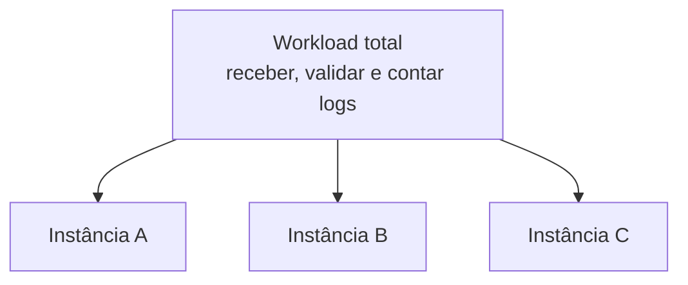

No post anterior, vimos que paralelismo e distribuição podem aumentar a capacidade de processamento. Mas como um workload grande vira trabalho para várias instâncias?

## O problema

Vamos voltar ao exemplo de contagem de erros por serviço. Uma máquina não acompanha mais todos os logs, então precisamos dividir o trabalho:



Cada instância passa a executar uma parte do workload. Isso pode aumentar a capacidade porque várias partes progridem ao mesmo tempo.

Mas a divisão cria duas perguntas que não existiam quando tudo rodava em uma única máquina:

1. Para onde cada registro deve ir?
2. Quando vários registros contribuem para o mesmo resultado, como eles chegam ao lugar certo?

### Nem todo trabalho precisa da mesma regra

Se uma etapa apenas valida a estrutura de cada log, um registro pode ser tratado de forma isolada. Qualquer instância disponível pode fazer essa validação.

Já uma contagem por serviço precisa de mais cuidado. Os registros do `payment-service` contribuem para a mesma contagem, então o sistema precisa garantir que o cálculo tenha acesso ao histórico necessário.

```text
payment-service ERROR
payment-service ERROR
payment-service ERROR
```

Ainda não vamos entrar na regra que decide o destino desses registros. Por enquanto, basta perceber que dividir o workload não é só abrir mais processos. É separar o trabalho de uma forma que preserve o resultado que queremos calcular.

### As partes precisam conversar

Depois da divisão, as instâncias podem precisar trocar dados, resultados intermediários ou informações sobre o progresso. Se elas estiverem em processos ou nodes diferentes, não compartilham memória diretamente.

É aí que entra a próxima pergunta: como um registro sai da memória de um processo e chega a outro?

## A ideia que quero guardar

Dividir o workload pode aumentar a capacidade, mas cria a responsabilidade de dar um destino aos registros e manter o cálculo correto. Quanto mais partes existem, mais importante se torna a comunicação e a coordenação entre elas.

No próximo post, vamos ver o que acontece quando esses dados precisam atravessar processos ou máquinas.
