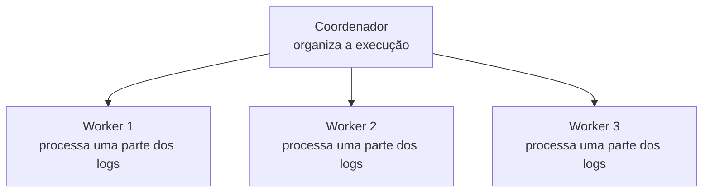

Depois de entender workload, concorrência, paralelismo, distribuição e comunicação entre processos, ainda falta uma peça: quem organiza a execução como um todo?

## O problema

Imagina que temos três máquinas executando partes de uma contagem de erros:



Os **workers** são quem executa o trabalho de verdade: recebem uma parte dos dados, fazem as transformações e mantêm o que for necessário enquanto processam.

O **coordenador** não precisa fazer a contagem de cada log. O papel dele é organizar a execução: decidir ou acompanhar quem ficou responsável por cada parte, observar o progresso e reagir quando algo não sai como esperado.

### Quando uma parte falha

Agora o Worker 2 para de funcionar. Os outros dois continuam de pé, mas uma parte do workload deixou de ser processada.

```text
Worker 1 → funcionando
Worker 2 → falhou
Worker 3 → funcionando
```

É uma **falha parcial**. O sistema não está completamente fora do ar, mas também não está completamente saudável.

Nesse momento, o coordenador precisa lidar com perguntas como:

- Quem vai assumir o trabalho que estava no Worker 2?
- Qual era o último estado conhecido dessa parte?
- Quais logs chegaram depois desse ponto?
- Como continuar sem perder uma contagem ou contá-la duas vezes?

O coordenador não resolve esses problemas sozinho. Ele depende de mecanismos como **estado salvo**, **checkpoints** e **possibilidade de reler os dados**. Mas é ele quem coordena a recuperação.

### Coordenar também é trabalho

Além de falhas, o coordenador acompanha recursos, atribui novas partes do trabalho quando necessário e ajuda a manter uma visão do conjunto. Os workers ficam mais próximos do processamento diário, o coordenador mantém a execução organizada como um todo.

Essa separação evita que cada worker tenha que descobrir sozinho o que o resto do sistema está fazendo.

## A ideia que quero guardar

Uma arquitetura distribuída costuma separar quem **coordena** de quem **executa**:

- Workers processam partes do workload
- Coordenador observa o conjunto, acompanha falhas e organiza a recuperação.

No próximo post, vou ligar esses papéis genéricos aos nomes usados pelo Apache Flink. Só depois vamos subir esses processos em um cluster local.
