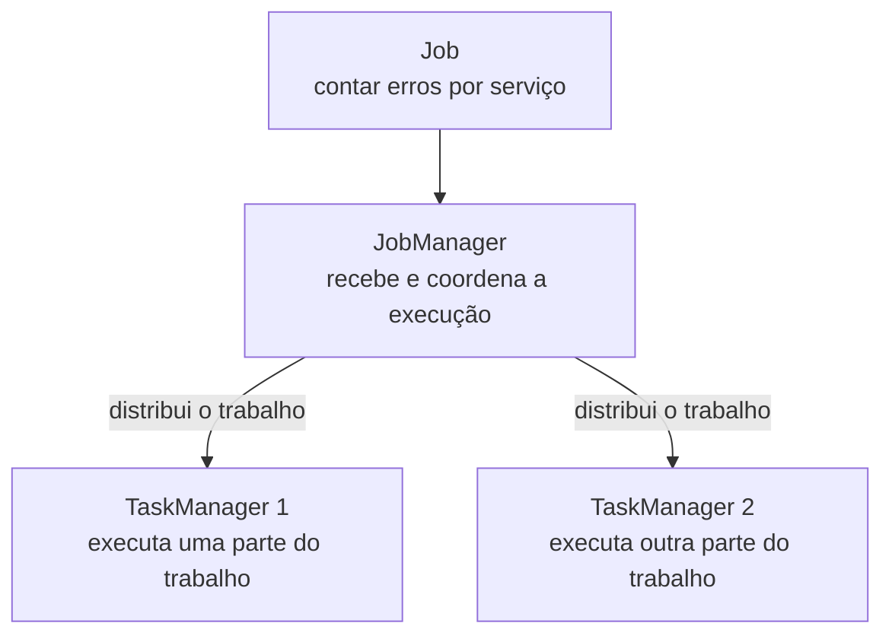

No post anterior, vimos que sistemas distribuídos costumam separar quem coordena de quem executa o trabalho. O Flink segue essa mesma ideia, mas dá nomes próprios para essas peças.

## O problema

Imagine que queremos executar nossa contagem de erros por serviço como uma computação contínua. No Flink, essa computação completa é um **Job**.

O Job precisa de alguém que acompanhe a execução e de processos que façam o trabalho acontecer. É aí que entram o **JobManager** e os **TaskManagers**.



### O papel do JobManager

O **JobManager** é a concretização do coordenador que vimos antes. Ele recebe o Job, organiza a execução, acompanha seu progresso e coordena a recuperação quando algo falha.

Ele não fica processando cada log individualmente. Seu trabalho é manter uma visão do conjunto: quais partes estão em execução, onde estão os recursos e o que precisa acontecer se uma delas parar.

### O papel dos TaskManagers

Os **TaskManagers** são os workers do Flink. Eles executam as partes do Job, recebem e enviam dados quando necessário e mantêm o estado usado durante o processamento.

Mais adiante, vamos dar nomes mais específicos para essas partes. Por enquanto, basta guardar que o trabalho real acontece nos TaskManagers.

Um TaskManager é um **processo**, não necessariamente uma máquina inteira. Em um ambiente local, ele pode rodar em um container; em produção, vários TaskManagers podem estar distribuídos por vários nodes.

## A ideia que quero guardar

O modelo genérico agora ganhou nomes concretos:

```text
coordenador → JobManager
workers     → TaskManagers
computação  → Job
```

No próximo post, vou subir esses processos localmente com Docker Compose e mostrar como eles formam um cluster Flink de verdade.

_Referência: [arquitetura do Apache Flink](https://nightlies.apache.org/flink/flink-docs-release-2.2/docs/concepts/flink-architecture/)._
