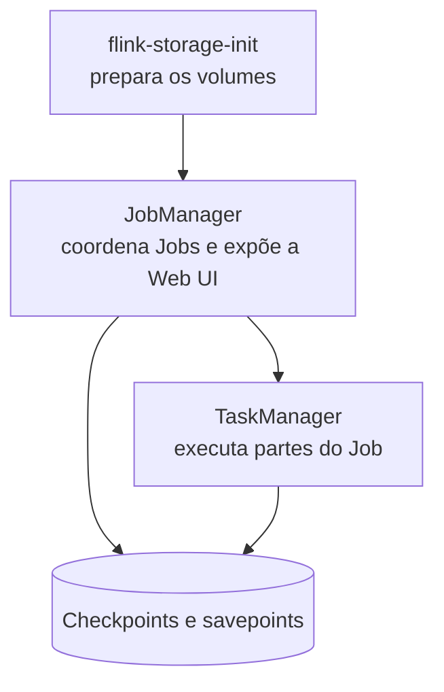

No post anterior, vimos como o Flink chama os papéis de coordenador e worker. Agora quero transformar JobManager e TaskManagers em algo que posso executar localmente.

Não preciso de várias máquinas físicas para estudar. O Docker Compose cria processos isolados no meu computador e deixa a relação entre coordenador, worker e armazenamento mais fácil de enxergar.

## O cluster que vamos subir

Este é o recorte do `compose.yaml` usado no laboratório. Ele cria um JobManager, um TaskManager e volumes para checkpoints e savepoints. Também há um volume de workspace que é uma escolha do laboratório, não uma exigência do Flink.

```yaml
name: flink-studies

services:
  flink-storage-init:
    image: flink:2.2.1-scala_2.12-java21
    user: "0:0"
    entrypoint: ["/bin/sh", "-c"]
    command:
      - chown -R 9999:9999 /opt/flink/checkpoints /opt/flink/savepoints
    volumes:
      - flink-checkpoints:/opt/flink/checkpoints
      - flink-savepoints:/opt/flink/savepoints

  jobmanager:
    image: flink:2.2.1-scala_2.12-java21
    command: jobmanager
    depends_on:
      flink-storage-init:
        condition: service_completed_successfully
    ports:
      - "8081:8081"
    environment:
      FLINK_PROPERTIES: |
        jobmanager.rpc.address: jobmanager
        jobmanager.memory.process.size: 1024m
        parallelism.default: 2
        state.checkpoints.dir: file:///opt/flink/checkpoints
        state.savepoints.dir: file:///opt/flink/savepoints
    volumes:
      - flink-checkpoints:/opt/flink/checkpoints
      - flink-savepoints:/opt/flink/savepoints
      - ../../../..:/workspace:ro

  taskmanager:
    image: flink:2.2.1-scala_2.12-java21
    command: taskmanager
    depends_on:
      jobmanager:
        condition: service_started
    environment:
      FLINK_PROPERTIES: |
        jobmanager.rpc.address: jobmanager
        taskmanager.memory.process.size: 1024m
        taskmanager.numberOfTaskSlots: 2
        parallelism.default: 2
        state.checkpoints.dir: file:///opt/flink/checkpoints
        state.savepoints.dir: file:///opt/flink/savepoints
    volumes:
      - flink-checkpoints:/opt/flink/checkpoints
      - flink-savepoints:/opt/flink/savepoints
      - ../../../..:/workspace:ro

volumes:
  flink-checkpoints:
  flink-savepoints:
```

### Antes de iniciar o Flink

`name` dá um nome ao ambiente Docker. Dentro de `services`, cada bloco cria um container com uma responsabilidade.

O `flink-storage-init` não executa um Job. Ele prepara os volumes que guardarão checkpoints e savepoints. A imagem do Flink usa um usuário próprio; por isso, o container inicia como `user: "0:0"`, executa o `chown` e garante que esse usuário tenha permissão de escrita nos diretórios montados.

`volumes` cria armazenamento persistente gerenciado pelo Docker. Assim, os arquivos de checkpoint não vivem apenas dentro de um container que pode ser removido.

### Quem coordena o Job

O serviço `jobmanager` usa a mesma imagem, mas `command: jobmanager` define seu papel. Ele será o processo que recebe Jobs, coordena a execução e expõe a Web UI.

| Configuração | O que ela faz |
| --- | --- |
| `depends_on` | Espera o preparo dos volumes terminar. |
| `8081:8081` | Expõe a Web UI em `http://localhost:8081`. |
| `jobmanager.rpc.address` | Dá aos outros processos o nome usado para localizar o JobManager na rede interna do Compose. |
| `jobmanager.memory.process.size` | Reserva 1 GB para o processo do JobManager. |
| `parallelism.default` | Define 2 como paralelismo padrão quando o Job não escolhe outro valor. |
| `state.checkpoints.dir` e `state.savepoints.dir` | Apontam para os diretórios persistentes montados no container. |

### O volume de workspace

O volume `../../../..:/workspace:ro` monta a raiz do meu diretório de estudos dentro do container. No meu caso, ele deixa o JAR gerado pelo Maven visível para o JobManager, então consigo submetê-lo com um caminho como `/workspace/01-fundamentos/...`.

O caminho relativo fica mais fácil de entender olhando a estrutura de diretórios que uso localmente:

```text
my-flink-studies/
└── 01-fundamentos/
    └── labs/
        ├── day00/
        │   └── resources/
        │       └── compose.yaml  ← arquivo atual
        └── day03/
```

Como o `compose.yaml` está em `labs/day00/resources`, `../../../..` sobe quatro níveis até `my-flink-studies`. É essa pasta que passa a existir como `/workspace` nos containers. Mesmo executando o comando na raiz desse diretório, o Docker Compose resolve o caminho relativo a partir da pasta do arquivo Compose.

Esse volume não é necessário para o Flink formar ou executar um cluster. Depois que o JobManager recebe o JAR, o próprio Flink o distribui para os TaskManagers. O mount no TaskManager existe porque, em práticas futuras, alguns Jobs vão ler arquivos de exemplo que também ficam nesse diretório.

O sufixo `:ro` significa *read-only*: os containers podem ler os arquivos, mas não alterá-los. Em outro projeto, esse caminho pode ser diferente, os arquivos podem entrar na imagem ou a fonte de dados pode estar fora da máquina local. O importante é que cada processo que precise ler um arquivo consiga acessá-lo no caminho configurado pelo Job.

### Quem executa o trabalho

O serviço `taskmanager` usa `command: taskmanager`. Ele é o worker do cluster: executa partes do Job atribuídas pelo JobManager.

Ele espera o JobManager iniciar e usa o mesmo `jobmanager.rpc.address` para se conectar a ele. `taskmanager.numberOfTaskSlots: 2` disponibiliza dois slots, ou seja, capacidade para executar até duas partes do Job ao mesmo tempo nesse processo. Os diretórios de checkpoint e savepoint são os mesmos para que o estado possa ser recuperado quando necessário.



## Subindo e verificando o ambiente

Na raiz do diretório de estudos, o ambiente sobe com:

```bash
docker compose -f 01-fundamentos/labs/day00/resources/compose.yaml up -d
```

Depois, posso confirmar os containers:

```bash
docker compose -f 01-fundamentos/labs/day00/resources/compose.yaml ps
```

Com JobManager e TaskManager em execução, a Web UI fica disponível em `http://localhost:8081`. Ainda não existe um Job para observar (esse é o próximo passo).

## A ideia que quero guardar

O Compose não é apenas uma forma prática de “rodar Flink”. Ele transforma os conceitos em processos reais: o JobManager coordena, o TaskManager executa e os volumes preservam o estado.

No próximo post, vou criar o projeto Java, gerar o JAR e submetê-lo a esse cluster.
